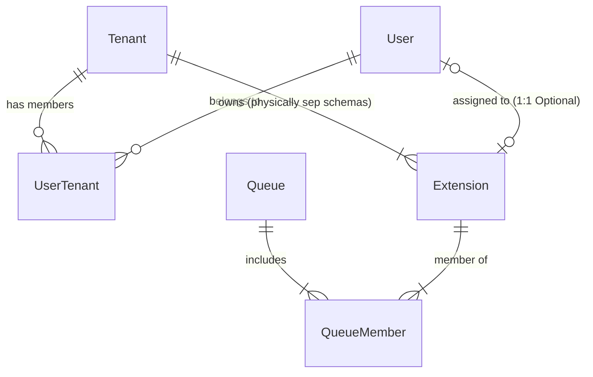

# Data Model: Multitenant PBX Foundation

## Schema Architecture

Required Pattern: **Schema-per-Tenant** via PostgreSQL.

### Global Schema (`public`)
Shared resources and routing logic.

| Entity | Table Name | Columns | Description |
|:---|:---|:---|:---|
| **Tenant** | `tenants` | `id` (UUID, PK), `name` (Text), `domain` (Text, Unique), `schema_name` (Text), `timezone` (Text), `locale` (Text), `created_at` (TS) | Customer organization root. |
| **System User** | `users` | `id` (UUID, PK), `email` (Text, Unique), `password_hash` (Text), `global_role` (Enum), `created_at` (TS) | Web Users (Admins/Agents). |
| **Tenant Membership** | `user_tenants` | `user_id` (UUID, FK), `tenant_id` (UUID, FK), `role` (Enum: owner, admin, agent) | Many-to-Many mapping of Users to Tenants. |

### Tenant Schema (Template: `tenant_{uuid}`)
Repeated for every tenant. Isolated data.

| Entity | Table Name | Columns | Description |
|:---|:---|:---|:---|
| **Extension** | `extensions` | `id` (UUID, PK), `extension_number` (Text, Unique), `auth_username` (UUID, Unique), `auth_password` (Text), `context` (Text), `user_id` (UUID, FK, Nullable) | SIP Endpoints. |
| **Queue** | `queues` | `id` (UUID, PK), `name` (Text), `strategy` (Enum: ring-all, round-robin), `moh_sound` (Text) | Call Center Queues. |
| **Queue Member** | `queue_members` | `queue_id` (UUID, FK), `extension_id` (UUID, FK), `tier` (Int), `level` (Int) | Validation of Extension in Queue. |
| **CDR** | `cdrs` | `id` (UUID, PK), `caller_id_name` (Text), `caller_id_number` (Text), `dest_number` (Text), `context` (Text), `start_time` (TS), `answer_time` (TS), `end_time` (TS), `duration` (Int), `recording_path` (Text) | Call Detail Records. |
| **Media File** | `media_files` | `id` (UUID, PK), `category` (Enum: moh, ivr), `original_name` (Text), `file_path` (Text), `uploaded_at` (TS) | Metadata for user-uploaded audio. |

## Relationships

## Field Constraints & Validation

1. **Tenants**
   - `domain`: Must be a valid FQDN or subdomain (e.g., `cust1.pbx.io`).
   - `schema_name`: Alphanumeric + underscore only. Derived from UUID or slug.

2. **Extensions**
   - `extension_number`: 2-5 digits. Unique within the Tenant Schema.
   - `auth_username`: Random UUID v4 (NOT user editable).
   - `auth_password`: Minimum 20 char random string (NOT user editable).

3. **Users**
   - `email`: Valid Email format.
   - `password_hash`: Argon2id encoded.

4. **Queues**
   - `strategy`: Must map to valid `mod_callcenter` strategies.
